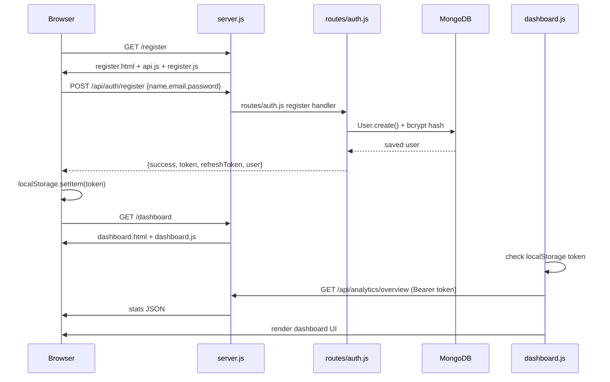

# AJ'S FocusFlow — Architecture Guide

> **Author:** Arjun M  
> **Stack:** Node.js + Express + MongoDB (backend) · HTML + CSS + Vanilla JS (frontend) · Socket.IO (real-time)

This document explains **exactly how the frontend and backend connect**, what each file does, and the **full sequence** from `npm start` → login/register → dashboard.

---

## Table of Contents

| # | Section | What you'll learn |
|---|---------|-------------------|
| 1 | [Quick Index — File Map](#1-quick-index--file-map) | Every important file and its role |
| 2 | [How Frontend Connects to Backend (Main Answer)](#2-how-frontend-connects-to-backend-main-answer) | The 3 connection lines that tie UI to API |
| 3 | [App Startup Sequence](#3-app-startup-sequence) | What happens when you run `npm start` |
| 4 | [Project Folder Structure](#4-project-folder-structure) | Full folder tree |
| 5 | [server.js — Line-by-Line Breakdown](#5-serverjs--line-by-line-breakdown) | Every major block in the entry file |
| 6 | [Frontend Script Loading Chain](#6-frontend-script-loading-chain) | How HTML pages load JS that talks to the API |
| 7 | [Register Flow (Step-by-Step)](#7-register-flow-step-by-step) | Register → API → DB → redirect to dashboard |
| 8 | [Login Flow (Step-by-Step)](#8-login-flow-step-by-step) | Login → API → JWT → redirect to dashboard |
| 9 | [Dashboard Load Flow](#9-dashboard-load-flow) | Token check → fetch data → render UI |
| 10 | [API Client (`public/js/api.js`)](#10-api-client-publicjsapijs) | How every `fetch()` call is built |
| 11 | [Auth Backend (`routes/auth.js`)](#11-auth-backend-routesauthjs) | Register, login, refresh, logout |
| 12 | [JWT Protection (`middleware/auth.js`)](#12-jwt-protection-middlewareauthjs) | How protected routes verify tokens |
| 13 | [Password Security (`models/User.js`)](#13-password-security-modelsuserjs) | bcrypt hashing on save |
| 14 | [Socket.IO Real-Time Layer](#14-socketio-real-time-layer) | Live task/timer/comment updates |
| 15 | [All API Endpoints](#15-all-api-endpoints) | Full REST API reference |
| 16 | [Environment Variables](#16-environment-variables) | `.env` keys and what they control |
| 17 | [Deployment (Render)](#17-deployment-render) | Production URLs and config |
| 18 | [Connection Lines Cheat Sheet](#18-connection-lines-cheat-sheet) | One table of every "link" line |

---

## 1. Quick Index — File Map

| File / Folder | Role |
|---------------|------|
| `server.js` | **Main entry.** Starts HTTP server, connects MongoDB, serves frontend, mounts API routes |
| `public/` | **Frontend root.** All HTML, CSS, JS the browser loads |
| `public/index.html` | Login page (home `/`) |
| `public/register.html` | Registration page (`/register`) |
| `public/dashboard.html` | Dashboard page (`/dashboard`) |
| `public/js/api.js` | **Frontend ↔ Backend bridge.** All `fetch()` calls to `/api/*` |
| `public/js/auth.js` | Login form handler |
| `public/js/register.js` | Register form handler |
| `public/js/dashboard.js` | Dashboard logic (stats, projects, tasks) |
| `public/js/socket.js` | Socket.IO client (real-time) |
| `routes/auth.js` | Auth API: register, login, refresh, logout |
| `routes/projects.js` | Projects CRUD API |
| `routes/tasks.js` | Tasks CRUD API |
| `routes/timeTracking.js` | Timer start/stop API |
| `routes/analytics.js` | Analytics/stats API |
| `routes/users.js` | User profile API |
| `routes/notifications.js` | Notifications API |
| `middleware/auth.js` | JWT `protect` middleware |
| `middleware/validator.js` | Request body validation |
| `models/User.js` | User schema + bcrypt |
| `models/Project.js` | Project schema |
| `models/Task.js` | Task schema |
| `models/TimeEntry.js` | Time tracking schema |
| `models/Notification.js` | Notification schema |
| `.env` | Secrets (Mongo URI, JWT keys) — **never committed** |

---

## 2. How Frontend Connects to Backend (Main Answer)

FocusFlow uses a **single-server architecture**: one Express process serves **both** the UI and the API. There is no separate React/Vite dev server.

### The 3 lines that establish the connection

```
┌─────────────────────────────────────────────────────────────────────────┐
│                         BROWSER (Frontend)                              │
│  index.html / register.html / dashboard.html                          │
│       ↓ loads                                                           │
│  public/js/api.js  →  fetch(`${window.location.origin}/api/...`)      │
└───────────────────────────────┬─────────────────────────────────────────┘
                                │ HTTP (same origin)
                                ▼
┌─────────────────────────────────────────────────────────────────────────┐
│                         server.js (Backend)                             │
│                                                                         │
│  LINE 24: app.use(express.static('public'))  ← serves HTML/CSS/JS      │
│  LINE 46: app.use('/api/auth', ...)          ← handles API requests    │
│  LINE 106-128: app.get('/dashboard', ...)    ← sends dashboard.html    │
└───────────────────────────────┬─────────────────────────────────────────┘
                                │
                                ▼
                         MongoDB Atlas / Local
```

| # | File | Line | Code | What it does |
|---|------|------|------|--------------|
| **A** | `server.js` | **24** | `app.use(express.static(path.join(__dirname, 'public')))` | **Opens the frontend.** Tells Express: "serve every file inside `public/` (HTML, CSS, JS) when the browser requests them." This is the main frontend connection. |
| **B** | `public/js/api.js` | **3** | `const API_BASE_URL = \`${window.location.origin}/api\`` | **Points frontend at backend.** Builds the API URL from the same host/port the page was loaded from. Local: `http://localhost:5000/api`. Render: `https://aj-s-focusflow.onrender.com/api`. |
| **C** | `server.js` | **46** | `app.use('/api/auth', require('./routes/auth'))` | **Mounts backend routes.** Any `POST /api/auth/login` from the browser hits `routes/auth.js`. |

### Why line 24 is the frontend connection

Before any API call happens, the browser must **download** the UI. Line 24 does that:

```js
// server.js — line 24
app.use(express.static(path.join(__dirname, 'public')));
```

| Request from browser | What Express returns |
|----------------------|----------------------|
| `GET /` | `public/index.html` (via line 106–108 route, or static fallback) |
| `GET /css/style.css` | `public/css/style.css` |
| `GET /js/api.js` | `public/js/api.js` |
| `GET /js/auth.js` | `public/js/auth.js` |
| `GET /dashboard` | `public/dashboard.html` (via line 114–116) |

Without line 24, the browser would have no HTML, CSS, or JavaScript to run.

### Why line 3 in api.js is the backend connection

Once the JS files load, the frontend talks to the backend via `fetch()`:

```js
// public/js/api.js — line 3
const API_BASE_URL = `${window.location.origin}/api`;

// public/js/api.js — line 78
const response = await fetch(`${API_BASE_URL}${endpoint}`, { ...options, headers: this.getHeaders() });
```

Example: login calls `api.login()` → `request('/auth/login')` → full URL becomes `http://localhost:5000/api/auth/login` → hits `routes/auth.js` line 96.

---

## 3. App Startup Sequence

When you run `npm start`, this happens **in order**:

| Step | File | Line(s) | Action |
|------|------|---------|--------|
| 1 | `package.json` | 7 | `"start": "node server.js"` runs the entry file |
| 2 | `server.js` | 9 | `dotenv.config()` loads `.env` (PORT, MONGODB_URI, JWT secrets) |
| 3 | `server.js` | 11–12 | Creates Express `app` and wraps it in `http.createServer` |
| 4 | `server.js` | 13–18 | Attaches Socket.IO to the HTTP server |
| 5 | `server.js` | 21–24 | Registers middleware: CORS, JSON parser, **static frontend** |
| 6 | `server.js` | 28–40 | Connects to MongoDB via `mongoose.connect(process.env.MONGODB_URI)` |
| 7 | `server.js` | 46–52 | Mounts all `/api/*` route modules |
| 8 | `server.js` | 57–103 | Registers Socket.IO event handlers |
| 9 | `server.js` | 106–128 | Registers HTML page routes (`/`, `/register`, `/dashboard`, etc.) |
| 10 | `server.js` | 141–144 | `server.listen(PORT)` — server is live |

**Result:**
- Frontend: `http://localhost:5000`
- API: `http://localhost:5000/api`

---

## 4. Project Folder Structure

```
AJ'S Focusflow/
│
├── server.js                 ← Entry point (frontend + backend + sockets)
├── package.json              ← Dependencies and npm scripts
├── .env                      ← Secrets (gitignored)
├── .env.example              ← Template for .env
├── render.yaml               ← Render deployment config
│
├── middleware/
│   ├── auth.js               ← JWT protect + role authorize
│   └── validator.js          ← express-validator error handler
│
├── models/
│   ├── User.js               ← User schema, bcrypt hash, comparePassword
│   ├── Project.js            ← Project schema
│   ├── Task.js               ← Task schema
│   ├── TimeEntry.js          ← Timer entries
│   └── Notification.js       ← Notifications
│
├── routes/
│   ├── auth.js               ← /api/auth/*
│   ├── projects.js           ← /api/projects/*
│   ├── tasks.js              ← /api/tasks/*
│   ├── timeTracking.js       ← /api/time/*
│   ├── analytics.js          ← /api/analytics/*
│   ├── users.js              ← /api/users/*
│   └── notifications.js      ← /api/notifications/*
│
└── public/                   ← FRONTEND (served by server.js line 24)
    ├── index.html            ← Login page
    ├── register.html         ← Register page
    ├── dashboard.html        ← Dashboard
    ├── projects.html         ← Projects page
    ├── analytics.html        ← Analytics page
    ├── profile.html          ← Profile page
    ├── css/
    │   ├── style.css         ← Base styles (login/register)
    │   └── dashboard.css     ← Dashboard styles
    └── js/
        ├── api.js            ← API client (fetch bridge)
        ├── auth.js           ← Login handler
        ├── register.js       ← Register handler
        ├── dashboard.js      ← Dashboard logic
        ├── projects.js       ← Projects page logic
        ├── analytics.js      ← Analytics charts
        ├── profile.js        ← Profile page logic
        ├── socket.js         ← Socket.IO client
        ├── timer.js          ← Timer widget
        ├── shortcuts.js      ← Keyboard shortcuts
        └── particles-config.js ← Background animation
```

---

## 5. server.js — Line-by-Line Breakdown

| Line | Code | Explanation |
|------|------|-------------|
| 1–7 | `require('express')`, `mongoose`, `cors`, `dotenv`, `path`, `http`, `socket.io` | Import all dependencies |
| 9 | `dotenv.config()` | Load `.env` into `process.env` |
| 11 | `const app = express()` | Create Express application |
| 12 | `const server = http.createServer(app)` | Wrap Express in raw HTTP server (needed for Socket.IO) |
| 13–18 | `socketIO(server, { cors: ... })` | Create Socket.IO instance attached to same server |
| 21 | `app.use(cors())` | Allow cross-origin requests (needed for API calls) |
| 22 | `app.use(express.json())` | Parse JSON request bodies (`req.body`) |
| 23 | `app.use(express.urlencoded(...))` | Parse form-encoded bodies |
| **24** | **`app.use(express.static(path.join(__dirname, 'public')))`** | **Serve frontend files from `public/` folder** |
| 28 | `mongoose.set('bufferCommands', false)` | Fail fast if DB is disconnected |
| 30–40 | `mongoose.connect(process.env.MONGODB_URI)` | Connect to MongoDB Atlas or local |
| 43 | `app.set('io', io)` | Make Socket.IO available inside route files |
| 46 | `app.use('/api/auth', require('./routes/auth'))` | Mount auth routes at `/api/auth` |
| 47 | `app.use('/api/projects', ...)` | Mount project routes |
| 48 | `app.use('/api/tasks', ...)` | Mount task routes |
| 49 | `app.use('/api/time', ...)` | Mount time tracking routes |
| 50 | `app.use('/api/analytics', ...)` | Mount analytics routes |
| 51 | `app.use('/api/users', ...)` | Mount user routes |
| 52 | `app.use('/api/notifications', ...)` | Mount notification routes |
| 57–103 | `io.on('connection', ...)` | Handle real-time socket events |
| 106–108 | `app.get('/', ...)` → `index.html` | Serve login page at `/` |
| 110–112 | `app.get('/register', ...)` → `register.html` | Serve register page |
| 114–116 | `app.get('/dashboard', ...)` → `dashboard.html` | Serve dashboard page |
| 118–128 | Other page routes | projects, analytics, profile |
| 141–144 | `server.listen(PORT, ...)` | Start listening on port 5000 (or Render's PORT) |

---

## 6. Frontend Script Loading Chain

Each HTML page loads scripts **in order**. Later scripts depend on earlier ones.

### Login page (`public/index.html`)

| Line | Script loaded | Purpose |
|------|---------------|---------|
| 78 | `particles.min.js` (CDN) | Animated background |
| 79 | `socket.io.min.js` (CDN) | Socket.IO client library |
| 80 | `js/particles-config.js` | Particle settings |
| **81** | **`js/api.js`** | **Creates global `api` object — backend bridge** |
| **82** | **`js/auth.js`** | **Login form → calls `api.login()`** |

### Register page (`public/register.html`)

| Line | Script loaded | Purpose |
|------|---------------|---------|
| 58 | `js/particles-config.js` | Background |
| **59** | **`js/api.js`** | **API client** |
| **60** | **`js/register.js`** | **Register form → calls `api.register()`** |

### Dashboard page (`public/dashboard.html`)

| Line | Script loaded | Purpose |
|------|---------------|---------|
| 369 | `socket.io.min.js` (CDN) | Real-time library |
| **371** | **`js/api.js`** | **API client for data fetching** |
| **372** | **`js/socket.js`** | **Connects Socket.IO after login** |
| 373 | `js/timer.js` | Timer widget |
| 374 | `js/shortcuts.js` | Keyboard shortcuts |
| **375** | **`js/dashboard.js`** | **Loads stats, projects, tasks via `api.*`** |

**Dependency chain:** `api.js` must load before `auth.js`, `register.js`, or `dashboard.js` because they all call `api.login()`, `api.register()`, `api.getProjects()`, etc.

---

## 7. Register Flow (Step-by-Step)

```
User fills form → register.js → api.js → fetch → server.js → routes/auth.js → MongoDB → tokens back → localStorage → redirect /dashboard
```

| Step | File | Line | What happens |
|------|------|------|--------------|
| 1 | `public/register.html` | 18 | User fills `#registerForm` (name, email, password, confirm) |
| 2 | `public/js/register.js` | 12 | Form `submit` event fires, `e.preventDefault()` stops page reload |
| 3 | `public/js/register.js` | 21–25 | Client-side check: passwords must match |
| 4 | `public/js/register.js` | 27–31 | Client-side check: password ≥ 6 characters |
| 5 | `public/js/register.js` | 38 | Calls `api.register(name, email, password)` |
| 6 | `public/js/api.js` | 112–116 | `register()` calls `this.request('/auth/register', { method: 'POST', body: ... })` |
| 7 | `public/js/api.js` | 78 | `fetch('http://localhost:5000/api/auth/register', ...)` sends HTTP POST |
| 8 | `server.js` | 46 | Express routes request to `routes/auth.js` |
| 9 | `routes/auth.js` | 38–42 | `express-validator` checks name, email, password format |
| 10 | `routes/auth.js` | 44 | `ensureDbConnected()` — returns 503 if MongoDB is down |
| 11 | `routes/auth.js` | 48 | `User.findOne({ email })` — check duplicate |
| 12 | `routes/auth.js` | 57–61 | `User.create({ name, email, password })` — saves to MongoDB |
| 13 | `models/User.js` | 51–54 | `pre('save')` hook hashes password with `bcrypt.hash(password, 12)` |
| 14 | `routes/auth.js` | 64–65 | `generateToken()` + `generateRefreshToken()` create JWTs |
| 15 | `routes/auth.js` | 71–83 | Returns `{ success: true, token, refreshToken, user }` JSON |
| 16 | `public/js/api.js` | 118–124 | Stores `token`, `refreshToken`, `user` in `localStorage` |
| 17 | `public/js/register.js` | 40–46 | Shows "Account created! Redirecting..." then `window.location.href = '/dashboard'` |
| 18 | `server.js` | 114–116 | `GET /dashboard` sends `dashboard.html` |
| 19 | `public/js/dashboard.js` | 4 | Checks `localStorage.getItem('token')` — if missing, redirects to `/` |
| 20 | `public/js/dashboard.js` | 5–6 | `loadUserInfo()` + `loadDashboardData()` fetch projects/tasks via API |

---

## 8. Login Flow (Step-by-Step)

| Step | File | Line | What happens |
|------|------|------|--------------|
| 1 | `public/index.html` | 18 | User fills `#loginForm` (email, password) |
| 2 | `public/js/auth.js` | 12–14 | If `token` already in `localStorage`, skip to `/dashboard` |
| 3 | `public/js/auth.js` | 70–71 | Form submit → `e.preventDefault()` |
| 4 | `public/js/auth.js` | 73–74 | Read email and password from inputs |
| 5 | `public/js/auth.js` | 81 | Calls `api.login(email, password)` |
| 6 | `public/js/api.js` | 95–99 | `login()` → `this.request('/auth/login', { method: 'POST', body: ... })` |
| 7 | `public/js/api.js` | 78 | `fetch('.../api/auth/login', ...)` |
| 8 | `server.js` | 46 | Routes to `routes/auth.js` |
| 9 | `routes/auth.js` | 96–99 | Validates email/password format |
| 10 | `routes/auth.js` | 101 | `ensureDbConnected()` check |
| 11 | `routes/auth.js` | 105 | `User.findOne({ email }).select('+password')` — load user with hidden password field |
| 12 | `routes/auth.js` | 114 | `user.comparePassword(password)` — bcrypt compare |
| 13 | `models/User.js` | 58–59 | `bcrypt.compare(candidatePassword, this.password)` |
| 14 | `routes/auth.js` | 122–130 | Generate new JWT + refresh token, set `isOnline = true` |
| 15 | `routes/auth.js` | 132–143 | Return `{ success: true, token, refreshToken, user }` |
| 16 | `public/js/api.js` | 101–107 | Save tokens + user to `localStorage` |
| 17 | `public/js/auth.js` | 83–89 | Show success message → `window.location.href = '/dashboard'` after 1 second |

---

## 9. Dashboard Load Flow

| Step | File | Line | What happens |
|------|------|------|--------------|
| 1 | `server.js` | 114–116 | Browser requests `/dashboard` → Express sends `dashboard.html` |
| 2 | `public/dashboard.html` | 371–375 | Loads `api.js`, `socket.js`, `timer.js`, `dashboard.js` |
| 3 | `public/js/dashboard.js` | 4 | **Auth gate:** no token → redirect to `/` (login) |
| 4 | `public/js/dashboard.js` | 5 | `loadUserInfo()` reads `user` from `localStorage`, sets name/avatar |
| 5 | `public/js/dashboard.js` | 6 | `loadDashboardData()` calls multiple API endpoints |
| 6 | `public/js/api.js` | 78 | Each call sends `Authorization: Bearer <token>` header |
| 7 | `middleware/auth.js` | 9–10 | Backend extracts token from `Authorization` header |
| 8 | `middleware/auth.js` | 22 | `jwt.verify(token, process.env.JWT_SECRET)` |
| 9 | `middleware/auth.js` | 25 | `User.findById(decoded.id)` → sets `req.user` |
| 10 | `middleware/auth.js` | 34 | `next()` — request proceeds to route handler |
| 11 | `public/js/socket.js` | 87–88 | If token exists, `initializeSocket()` connects real-time |

---

## 10. API Client (`public/js/api.js`)

| Line | Code | Explanation |
|------|------|-------------|
| 3 | `const API_BASE_URL = \`${window.location.origin}/api\`` | Base URL for all API calls (same host as frontend) |
| 6–9 | `constructor()` | Reads `token` and `refreshToken` from `localStorage` on page load |
| 12–19 | `localLogout()` | Clears tokens from memory + `localStorage`, redirects to `/` |
| 22–30 | `getHeaders()` | Builds headers; adds `Authorization: Bearer <token>` if logged in |
| 33–51 | `handleResponse()` | On 401 → try refresh token; on failure → `localLogout()` |
| 54–73 | `refreshAccessToken()` | `POST /api/auth/refresh` with stored refresh token |
| 76–92 | `request(endpoint, options)` | **Core method.** `fetch(API_BASE_URL + endpoint)` with auth headers |
| 95–110 | `login(email, password)` | `POST /auth/login` → save tokens on success |
| 112–127 | `register(name, email, password)` | `POST /auth/register` → save tokens on success |
| 129–137 | `logout()` | `POST /auth/logout` → clear local state |
| 275 | `const api = new API()` | Creates global `api` instance used by all page scripts |

---

## 11. Auth Backend (`routes/auth.js`)

| Line | Route | Method | Access | What it does |
|------|-------|--------|--------|--------------|
| 10–19 | — | — | — | `ensureDbConnected()` — returns 503 if MongoDB not ready |
| 22–26 | — | — | — | `generateToken(id)` — signs JWT with `JWT_SECRET` |
| 29–33 | — | — | — | `generateRefreshToken(id)` — signs refresh JWT |
| 38–91 | `/register` | POST | Public | Validate → check duplicate → create user → return tokens |
| 96–152 | `/login` | POST | Public | Validate → find user → bcrypt compare → return tokens |
| 157–192 | `/refresh` | POST | Public | Verify refresh token → issue new access token |
| 197–210 | `/me` | GET | Protected | Return current user profile |
| 215–233 | `/logout` | POST | Protected | Clear refresh token, set offline |

---

## 12. JWT Protection (`middleware/auth.js`)

Used by every protected route (projects, tasks, time, analytics, users).

| Line | Code | Explanation |
|------|------|-------------|
| 4 | `exports.protect = async (req, res, next)` | Middleware function |
| 9–10 | `req.headers.authorization.split(' ')[1]` | Extract token from `Bearer <token>` header |
| 13–17 | `if (!token) return 401` | Reject if no token sent |
| 22 | `jwt.verify(token, process.env.JWT_SECRET)` | Decode and verify JWT signature + expiry |
| 25 | `User.findById(decoded.id).select('-password')` | Load user, exclude password field |
| 34 | `next()` | Token valid → continue to route handler |

**How a protected request flows:**

```
Browser: api.getProjects()
  → fetch('/api/projects', { headers: { Authorization: 'Bearer eyJ...' } })
    → server.js line 47: app.use('/api/projects', ...)
      → routes/projects.js: router.get('/', protect, ...)
        → middleware/auth.js line 22: jwt.verify()
          → routes/projects.js: Project.find({ ... })
            → JSON response back to browser
```

---

## 13. Password Security (`models/User.js`)

| Line | Code | Explanation |
|------|------|-------------|
| 18–22 | `password: { select: false }` | Password never returned in normal queries |
| 51–54 | `pre('save')` → `bcrypt.hash(this.password, 12)` | Hash password with 12 salt rounds before saving to DB |
| 58–59 | `comparePassword(candidate)` → `bcrypt.compare(...)` | Compare login password against stored hash |

**Password is never stored in plain text.** Register saves a hash; login compares against that hash.

---

## 14. Socket.IO Real-Time Layer

### Server side (`server.js`)

| Line | Event | Direction | What it does |
|------|-------|-----------|--------------|
| 57 | `connection` | Server listens | New browser tab connects |
| 61–67 | `user-online` | Client → Server | Mark user online, join `user-<id>` room |
| 70–73 | `join-project` | Client → Server | Join `project-<id>` room |
| 76–78 | `task-update` | Client → Server → All in room | Broadcast task changes |
| 81–83 | `timer-start` | Client → Server → User room | Notify timer started |
| 85–87 | `timer-stop` | Client → Server → User room | Notify timer stopped |
| 90–92 | `new-comment` | Client → Server → Project room | Broadcast new comment |

### Client side (`public/js/socket.js`)

| Line | Code | Explanation |
|------|------|-------------|
| 5–8 | `socketURL = window.location.origin` | Connect to same server as frontend |
| 8 | `socket = io(socketURL)` | Open WebSocket connection |
| 12 | `socket.emit('user-online', user.id)` | Tell server this user is active |
| 29–36 | `socket.on('task-updated', ...)` | Receive task updates, dispatch browser event |
| 87–88 | Auto-init if token exists | Only connect sockets when logged in |

---

## 15. All API Endpoints

### Auth — `routes/auth.js` (mounted at `/api/auth`)

| Method | Endpoint | Auth | Description |
|--------|----------|------|-------------|
| POST | `/api/auth/register` | No | Create account |
| POST | `/api/auth/login` | No | Sign in |
| POST | `/api/auth/refresh` | No | Renew access token |
| GET | `/api/auth/me` | Yes | Get current user |
| POST | `/api/auth/logout` | Yes | Sign out |

### Projects — `routes/projects.js` (mounted at `/api/projects`)

| Method | Endpoint | Auth | Description |
|--------|----------|------|-------------|
| GET | `/api/projects` | Yes | List user's projects |
| POST | `/api/projects` | Yes | Create project |
| GET | `/api/projects/:id` | Yes | Get one project |
| PUT | `/api/projects/:id` | Yes | Update project |
| DELETE | `/api/projects/:id` | Yes | Delete project |

### Tasks — `routes/tasks.js` (mounted at `/api/tasks`)

| Method | Endpoint | Auth | Description |
|--------|----------|------|-------------|
| GET | `/api/tasks` | Yes | List tasks (filterable) |
| POST | `/api/tasks` | Yes | Create task |
| PUT | `/api/tasks/:id` | Yes | Update task |
| DELETE | `/api/tasks/:id` | Yes | Delete task |

### Time — `routes/timeTracking.js` (mounted at `/api/time`)

| Method | Endpoint | Auth | Description |
|--------|----------|------|-------------|
| POST | `/api/time/start` | Yes | Start timer |
| POST | `/api/time/stop/:id` | Yes | Stop timer |
| GET | `/api/time` | Yes | List time entries |
| GET | `/api/time/active` | Yes | Get active timer |

### Analytics — `routes/analytics.js` (mounted at `/api/analytics`)

| Method | Endpoint | Auth | Description |
|--------|----------|------|-------------|
| GET | `/api/analytics/overview` | Yes | Dashboard stats |
| GET | `/api/analytics/project/:id` | Yes | Per-project stats |

### Users — `routes/users.js` (mounted at `/api/users`)

| Method | Endpoint | Auth | Description |
|--------|----------|------|-------------|
| GET | `/api/users` | Yes | List users |
| GET | `/api/users/:id` | Yes | Get user profile |

### Notifications — `routes/notifications.js` (mounted at `/api/notifications`)

| Method | Endpoint | Auth | Description |
|--------|----------|------|-------------|
| GET | `/api/notifications` | Yes | List notifications |
| PUT | `/api/notifications/read` | Yes | Mark as read |

---

## 16. Environment Variables

| Variable | File | Purpose |
|----------|------|---------|
| `PORT` | `.env` line 1 | Server port (5000 local, 10000 on Render) |
| `MONGODB_URI` | `.env` line 2 | MongoDB Atlas connection string |
| `JWT_SECRET` | `.env` line 3 | Signs access tokens |
| `JWT_REFRESH_SECRET` | `.env` line 4 | Signs refresh tokens |
| `JWT_EXPIRE` | `.env` line 5 | Access token lifetime (e.g. `7d`) |
| `JWT_REFRESH_EXPIRE` | `.env` line 6 | Refresh token lifetime (e.g. `30d`) |
| `NODE_ENV` | `.env` line 7 | `development` or `production` |

Loaded by `server.js` line 9: `dotenv.config()`.

---

## 17. Deployment (Render)

| Item | Value |
|------|-------|
| Live URL | `https://aj-s-focusflow.onrender.com` |
| Frontend | `https://aj-s-focusflow.onrender.com/` |
| Register | `https://aj-s-focusflow.onrender.com/register` |
| Dashboard | `https://aj-s-focusflow.onrender.com/dashboard` |
| API base | `https://aj-s-focusflow.onrender.com/api` |
| GitHub | `https://github.com/Arjun-hub-create/AJ-S-FOCUSFLOW` |
| Config | `render.yaml` — build: `npm install`, start: `npm start` |
| Env group | `Arjun M` — must contain `MONGODB_URI` |

On Render, `public/js/api.js` line 3 automatically resolves to `https://aj-s-focusflow.onrender.com/api` because it uses `window.location.origin`.

---

## 18. Connection Lines Cheat Sheet

Every line in the codebase that **establishes a link** between frontend and backend:

| # | File | Line | Code (short) | Connection type |
|---|------|------|--------------|-----------------|
| 1 | `server.js` | 24 | `express.static('public')` | **Serves frontend files to browser** |
| 2 | `server.js` | 46 | `app.use('/api/auth', ...)` | **Mounts auth API** |
| 3 | `server.js` | 47 | `app.use('/api/projects', ...)` | **Mounts projects API** |
| 4 | `server.js` | 48 | `app.use('/api/tasks', ...)` | **Mounts tasks API** |
| 5 | `server.js` | 49 | `app.use('/api/time', ...)` | **Mounts time API** |
| 6 | `server.js` | 50 | `app.use('/api/analytics', ...)` | **Mounts analytics API** |
| 7 | `server.js` | 106 | `app.get('/', ... index.html)` | **Serves login page** |
| 8 | `server.js` | 114 | `app.get('/dashboard', ... dashboard.html)` | **Serves dashboard page** |
| 9 | `public/js/api.js` | 3 | `API_BASE_URL = origin + '/api'` | **Frontend knows backend URL** |
| 10 | `public/js/api.js` | 78 | `fetch(API_BASE_URL + endpoint)` | **HTTP request to backend** |
| 11 | `public/js/api.js` | 27 | `Authorization: Bearer ${token}` | **Sends JWT to backend** |
| 12 | `public/js/auth.js` | 81 | `api.login(email, password)` | **Login form → API** |
| 13 | `public/js/auth.js` | 88 | `window.location.href = '/dashboard'` | **Redirect after login** |
| 14 | `public/js/register.js` | 38 | `api.register(name, email, password)` | **Register form → API** |
| 15 | `public/js/register.js` | 45 | `window.location.href = '/dashboard'` | **Redirect after register** |
| 16 | `public/js/dashboard.js` | 4 | `localStorage.getItem('token')` check | **Auth gate on dashboard** |
| 17 | `public/index.html` | 81 | `<script src="js/api.js">` | **Loads API client on login page** |
| 18 | `public/register.html` | 59 | `<script src="js/api.js">` | **Loads API client on register page** |
| 19 | `public/dashboard.html` | 371 | `<script src="js/api.js">` | **Loads API client on dashboard** |
| 20 | `middleware/auth.js` | 22 | `jwt.verify(token, JWT_SECRET)` | **Backend verifies JWT** |
| 21 | `public/js/socket.js` | 8 | `io(socketURL)` | **WebSocket connection to server** |
| 22 | `server.js` | 57 | `io.on('connection', ...)` | **Server accepts WebSocket** |

---

## End-to-End Diagram



---

*Built by Arjun M — AJ'S FocusFlow*
